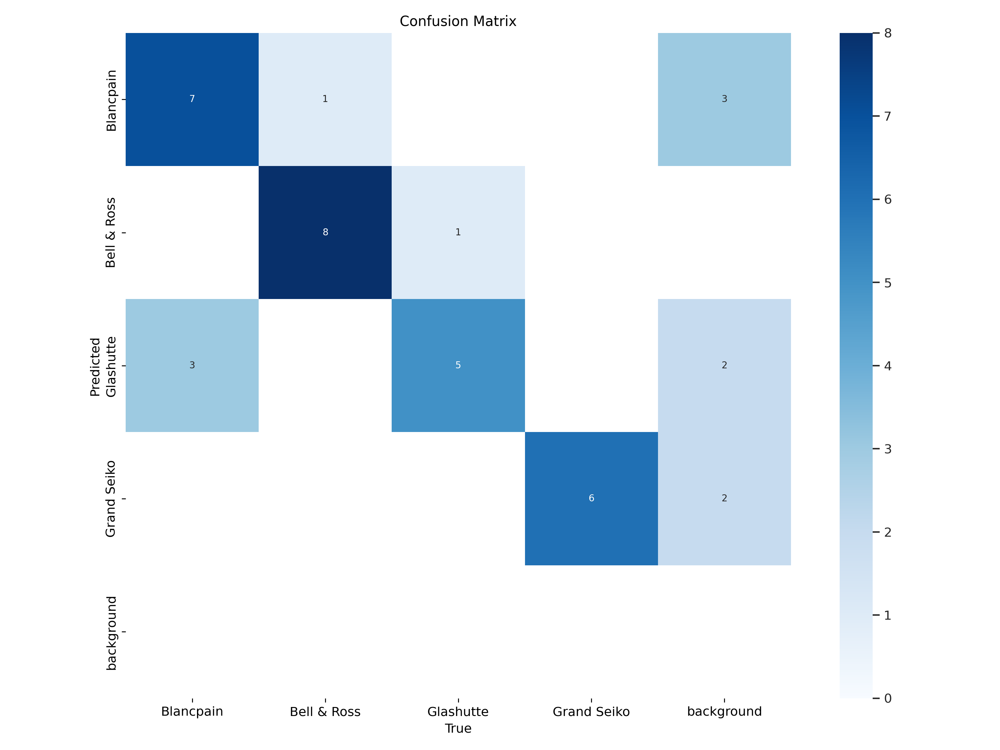
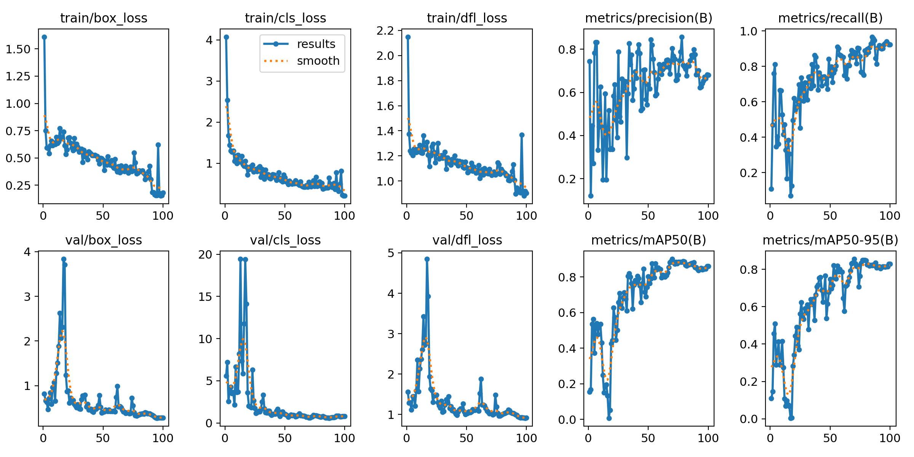

# Watch Brand Detection and Classification

This project involves training a YOLOv8 model to detect and classify four different brands of watches in images. The dataset includes labeled images of four watch brands: Blancpain, Bell & Ross, Glashutte, and Grand Seiko. The project demonstrates the effectiveness of YOLOv8 in detecting and classifying watches across multiple classes with high accuracy.

## Dataset

The dataset consists of 163 images divided into three sets:

- **Training Set**: 114 images
- **Validation Set**: 32 images
- **Test Set**: 17 images

### Classes
The dataset includes the following four watch brands:

1. **Blancpain**
2. **Bell & Ross**
3. **Glashutte**
4. **Grand Seiko**

### Annotation Tool
Annotations were created using [LabelImg](https://github.com/heartexlabs/labelImg), with bounding boxes around each watch to label its brand.

## Model

The model used is **YOLOv8** (Ultralytics YOLOv8.1.42), a state-of-the-art deep learning model for object detection. Training was performed on Google Colab with GPU acceleration.

### Training Parameters

- **Epochs**: 100
- **Batch Size**: 16
- **Input Size**: 640 x 640
- **Optimizer**: Adam
- **Losses**:
  - **box_loss**: Bounding box regression loss
  - **cls_loss**: Classification loss
  - **dfl_loss**: Distribution Focal Loss for precise localization

## Results

The final performance of the model at the end of 100 epochs is summarized below:

### Losses (at Epoch 100)
- **Box Loss**: 0.1802
- **Classification Loss**: 0.2083
- **DFL Loss**: 0.9043

### Overall Performance Metrics (on the Validation Set)
- **Box Precision (P)**: 0.805
- **Recall (R)**: 0.879
- **mAP50**: 0.901
- **mAP50-95**: 0.855

### Class-wise Performance Metrics

| Class         | Precision | Recall | mAP50 | mAP50-95 |
|---------------|-----------|--------|-------|----------|
| Blancpain     | 0.736     | 0.84   | 0.882 | 0.708    |
| Bell & Ross   | 0.883     | 0.844  | 0.963 | 0.953    |
| Glashutte     | 0.695     | 0.833  | 0.766 | 0.766    |
| Grand Seiko   | 0.904     | 1.0    | 0.995 | 0.995    |

The model performed best on **Grand Seiko** and **Bell & Ross**, with high precision, recall, and mAP scores, indicating strong accuracy in detecting and classifying these brands. **Blancpain** and **Glashutte** had slightly lower precision, suggesting some false positives for these classes. Overall, the model achieves high accuracy and can effectively detect and classify watches from the four brands in the dataset.

### Confusion Matrix
The confusion matrix shows the accuracy of predictions across each class.

### Training Loss and Performance Graphs

These graphs illustrate the loss reduction and accuracy improvement over the training epochs.

## Conclusion

This project demonstrates the use of YOLOv8 for watch brand detection and classification. With high precision and recall, the model shows good potential for accurately identifying watch brands. Future improvements could include increasing the dataset size, especially for classes with lower precision, and further hyperparameter tuning to improve model robustness.
